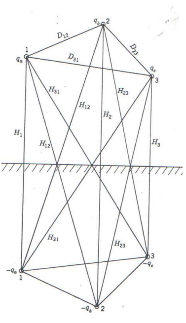

# HV-Transmission-Line-Selection

This project studies the selection of transmission lines according to the transmission line parameters such as number of circuits, number of bundle conductors and a library of ACSR conductors. There are different types of transmission towers, and each of these towers has different configurations.

### The parameters that are examined:

| Parameters covered in the project |
| -----|
|Number of circuits|
|Number of bundle conductors, where bundles form a regular polygon|
|Bundle distance, which is the length of the polygon that a bundle form|
|Length of the line|
|Name of the ACSR conductor|
|Location of the phases with respect to the origin|
|A library of ACSR conductors and their parameters|

At the beginning of the project, the library parameters were in Imperial Unit System, and in order to 
use these parameters, these are converted to SI units. Furthermore, input parameters such as the
𝑆𝑏𝑎𝑠𝑒, 𝑉𝑏𝑎𝑠𝑒, number of circuits, number of bundle conductors per phase, bundle distance, length of 
the line, the conductor's name, and the conductors' coordinates were given. Also, the library of the 
ACSR conductors and their parameters were given. In this library, the conductor's name, Aluminum 
area, stranding, layers of Aluminum, outside diameter, DC resistance, AC resistance, and GMR of the 
conductors were included. At the end of the project, series resistance, series reactance, and shunt 
capacitances per unit are calculated.

To find the input line parameters from the given raw input text, the parsing property of Python is used. 
This is the main idea of the first phase of the project. Using this property, these parameters are 
extracted from the input text and then converted to SI units. At the end of the first phase, these are 
the parameters that are calculated:

$𝑆_{𝐵𝑎𝑠𝑒}$, $𝑉_{𝐵𝑎𝑠𝑒}$, $𝑁_{𝑏𝑢𝑛𝑑𝑙𝑒}$, $𝑑_{𝑏𝑢𝑛𝑑𝑙𝑒}$, $𝑙𝑒𝑛𝑔𝑡ℎ$, 𝑐𝑜𝑛𝑑𝑢𝑐𝑡𝑜𝑟 𝑛𝑎𝑚𝑒, $r_{𝑜𝑢𝑡𝑠𝑖𝑑𝑒}$, $𝑅_{𝑎𝑐}$ 𝑎𝑛𝑑 $𝐺𝑀𝑅_{𝑐𝑜𝑛𝑑𝑢𝑐𝑡𝑜𝑟}$

Moving on, in the project's second phase, these parameters are utilized, and the series resistance, 
series reactance, and shunt susceptance are calculated per unit.

Series resistance is calculated by using the 𝑅𝑎𝑐 𝑎𝑛𝑑 𝑁𝑏𝑢𝑛𝑑𝑙𝑒. The AC resistance Number of bundle 
conductors in each phase is divided by the number of bundle conductors in each phase. Then, the result 
is multiplied by the length of the line, which gives the total series resistance of the line. To construct 
the table of base values, the 𝑆𝐵𝑎𝑠𝑒, 𝑉𝐵𝑎𝑠𝑒 values are used. The series resistance in per unit is the 
following:

$\Large R_{pu} = \frac{R}{Z_{Base}}$

After calculating the series resistance per unit, the series reactance per unit is calculated. This time the 
calculations are more complex since there are eight different possibilities in the 𝑁𝑏𝑢𝑛𝑑𝑙𝑒. According to 
the number of bundle conductors in each phase, the calculation of the GMR changes since it is related 
to the geometry of the conductors.

To begin with, geometric mean distance, GMD is calculated. To calculate the GMD, the position of each 
phase is utilized, and the difference between each phase is found. The distance between each phase is 
denoted by the letter D. The following formula is used to calculate the difference between the phases:

$\Large D_{ab} = \sqrt{(x_1 - x_2)^2 + (y_1 - y_2)^2}$

$\Large D_{bc} = \sqrt{(x_2 - x_3)^2 + (y_2 - y_3)^2}$

$\Large D_{ca} = \sqrt{(x_3 - x_1)^2 + (y_3 - y_1)^2}$

After calculating the distance between the phases, the GMD is found by the following:

$\Large GMD = \sqrt[3]{D_{ab} * D_{bc} * D_{ca}}$

When it comes to the calculation of the GMR, the formula changes according to the number of the 
bundle conductors in each phase. So, each case is considered separately.

| $\Large N_{bundle}$| Calculation of GMR |
| --------| -------------------|
| $\Large N_{bundle} = 1$ | $\Large GMR = GMR_{conductor}$ |
| $\Large N_{bundle} = 2$ | $\Large GMR = \sqrt{GMR_{conductor} * d_{bundle}}$|
| $\Large N_{bundle} = 3$ | $\Large GMR = \sqrt[3]{GMR_{conductor} * d_{bundle}^2}$|
| $\Large N_{bundle} = 4$ | $\Large GMR = \sqrt[4]{GMR_{conductor} * d_{bundle}^3 * \sqrt{2}}$ |
| $\Large N_{bundle} = 5$ | $\Large GMR = \sqrt[5]{GMR_{conductor} * d_{bundle}^4 * \Big(\frac{\sqrt{5} + 1}{2}\Big)^2}$ |
| $\Large N_{bundle} = 6$ | $\Large GMR = \sqrt[6]{GMR_{conductor} * d_{bundle}^5 * 6}$ |
| $\Large N_{bundle} = 7$ | $\Large GMR = \sqrt[7]{GMR_{conductor} * d_{bundle}^6 * \frac{\cos^2(\frac{\pi}{7})}{\sin^2(\frac{\pi}{14})}} $ |
| $\Large N_{bundle} = 8$ | $\Large GMR = \sqrt[8]{GMR_{conductor} * d_{bundle}^7 * (2 + \sqrt{2})^2 * (1 + \sqrt{2})^2  * (4 + 2\sqrt{2}) } $ |

After calculating the GMR values according to the number of bundle conductors in each phase, the 
series line reactance can be calculated by the following equation:

$\Large X = 4 * \pi * f * 10^{-7} * \ln{\Big(\frac{GMD}{GMR}\Big)}$

This gives the series line reactance. Then, the result is converted to per unit by dividing the series line reactance by the impedance base.

$\Large X_{pu} = \frac{X}{Z_{Base}}$ where $\Large Z_{Base} = \frac{V_{Base}^2}{S_{Base}}$

In the next part, the shunt susceptance is calculated. To calculate the shunt susceptance, the GMD and 
𝑟𝑒𝑞 is calculated first. The GMD calculation is calculated while calculating the series reactance. So, it is 
the same for the shunt susceptance case. On the other hand, the calculation of the 𝑟𝑒𝑞 is done by 
considering the 𝑁𝑏𝑢𝑛𝑑𝑙𝑒 since the geometry changes according to the number of bundle conductors in 
each phase. In the beginning, the outside diameter is divided by two so that the outside radius is used.

| $\Large N_{bundle}$| Calculation of $\Large r_{eq}$ |
| --------| -------------------|
| $\Large N_{bundle} = 1$ | $\Large r_{eq} = r_{outside}$ |
| $\Large N_{bundle} = 2$ | $\Large r_{eq} = \sqrt{r_{outside} * d_{bundle}}$|
| $\Large N_{bundle} = 3$ | $\Large r_{eq} = \sqrt[3]{r_{outside} * d_{bundle}^2}$|
| $\Large N_{bundle} = 4$ | $\Large r_{eq} = \sqrt[4]{r_{outside} * d_{bundle}^3 * \sqrt{2}}$ |
| $\Large N_{bundle} = 5$ | $\Large r_{eq} = \sqrt[5]{r_{outside} * d_{bundle}^4 * \Big(\frac{\sqrt{5} + 1}{2}\Big)^2}$ |
| $\Large N_{bundle} = 6$ | $\Large r_{eq} = \sqrt[6]{r_{outside} * d_{bundle}^5 * 6}$ |
| $\Large N_{bundle} = 7$ | $\Large r_{eq} = \sqrt[7]{r_{outside} * d_{bundle}^6 * \frac{\cos^2(\frac{\pi}{7})}{\sin^2(\frac{\pi}{14})}} $ |
| $\Large N_{bundle} = 8$ | $\Large r_{eq} = \sqrt[8]{r_{outside} * d_{bundle}^7 * (2 + \sqrt{2})^2 * (1 + \sqrt{2})^2  * (4 + 2\sqrt{2}) } $ |

After calculating the 𝑟𝑒𝑞 values according to the number of bundle conductors in each phase, the effect 
of Earth on the capacitance is calculated. To do this, the method of images is used. 

In this method, the mirrored images of the conductors are 
assumed to be in negative charges, and they are below the 
surface of the Earth. Since the Earth changes the electric field
of the line, the flux between the original conductors and their 
images is perpendicular to the plane, and this plane is an 
equipotential surface.

The distances for the same phases between the original 
conductor and the image conductor are denoted by 
𝐻1, 𝐻2 𝑎𝑛𝑑 𝐻3, respectively. Moreover, the distances for the 
different phases are denoted by 𝐻12, 𝐻23 𝑎𝑛𝑑 𝐻31, 
respectively.

$\Large H_1 = \sqrt{(x_1 - x_{1_{image}})^2 + (y_1 - y_{1_{image}})^2} $
$\Large H_2 = \sqrt{(x_2 - x_{2_{image}})^2 + (y_2 - y_{2_{image}})^2} $
$\Large H_3 = \sqrt{(x_3 - x_{3_{image}})^2 + (y_3 - y_{3_{image}})^2} $
$\Large H_{12} = \sqrt{(x_1 - x_{2_{image}})^2 + (y_1 - y_{2_{image}})^2} $
$\Large H_{23} = \sqrt{(x_2 - x_{3_{image}})^2 + (y_2 - y_{3_{image}})^2} $
$\Large H_{31} = \sqrt{(x_3 - x_{1_{image}})^2 + (y_3 - y_{1_{image}})^2} $

Then, the capacitance can be calculated by the following equation:

$\Large C = \sqrt{\frac{2 * \pi * k}{\ln{\frac{GMD}{r_{eq}}} - \ln{\frac{\sqrt[3]{H_{12} * H_{23} * H_{31}}}{\sqrt[3]{H_1 * H_2 * H_3}}}}}$

After calculating the capacitance, the shunt capacitance is calculated by the following formula:

$\Large B = 2 * \pi * f * C * length$

This gives the shunt capacitance. Then, the result is converted to per unit by dividing the shunt capacitance by the admittance base.

$\Large B_{pu} = \frac{B}{Y_{Base}}$ where $\Large Y_{Base} = \frac{S_{Base}}{V_{Base}^2}$

At the end of these calculations, these results are obtained:

| Output | Value |
|--------|-------|
| $R_{pu}$ | 0.0040992874465199305 |
| $X_{pu}$ | 0.08628192473705763|
| $B_{pu}$ | 0.20209261275800838|

